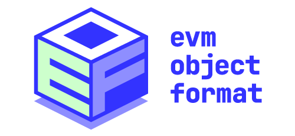

# "Mega EOF Endgame" Specification (EOFv1)



## Preface

This unified specification should be used as a guide to understand the various changes the EVM Object Format is proposing. See appendix for the list of EIPs, which stand as the official specification.

While EOF is extensible, in this document we discuss the first version, EOFv1.

## Container

EVM bytecode is traditionally an unstructured sequence of instructions. EOF introduces the concept of a container, which brings structure to byte code. The container consists of a header and then several sections.

```
container := header, body
header := 
    magic, version, 
    kind_types, types_size, 
    kind_code, num_code_sections, code_size+,
    [kind_container, num_container_sections, container_size+,]
    kind_data, data_size,
    terminator
body := types_section, code_section+, container_section*, data_section
types_section := (inputs, outputs, max_stack_height)+
```

_note: `,` is a concatenation operator, `+` should be interpreted as "one or more" of the preceding item, `*` should be interpreted as "zero or more" of the preceding item, and `[item]` should be interpeted as an optional item._

#### Header

| name              | length   | value  | description |
|-------------------|----------|---------------|-------------|
| magic             | 2 bytes  | 0xEF00        | EOF prefix  |
| version           | 1 byte   | 0x01          | EOF version |
| kind_types        | 1 byte   | 0x01          | kind marker for types size section |
| types_size        | 2 bytes  | 0x0004-0xFFFF | 16-bit unsigned big-endian integer denoting the length of the type section content |
| kind_code         | 1 byte   | 0x02          | kind marker for code size section |
| num_code_sections | 2 bytes  | 0x0001-0xFFFF | 16-bit unsigned big-endian integer denoting the number of the code sections |
| code_size         | 2 bytes  | 0x0001-0xFFFF | 16-bit unsigned big-endian integer denoting the length of the code section content |
| kind_container    | 1 byte   | 0x03          | kind marker for container size section |
| num_container_sections | 2 bytes  | 0x0001-0x00FF | 16-bit unsigned big-endian integer denoting the number of the container sections |
| container_size    | 2 bytes  | 0x0001-0xFFFF | 16-bit unsigned big-endian integer denoting the length of the container section content |
| kind_data         | 1 byte   | 0x04          | kind marker for data size section |
| data_size         | 2 bytes  | 0x0000-0xFFFF | 16-bit unsigned big-endian integer denoting the length of the data section content (for not yet deployed containers this can be more than the actual content, see [Data Section Lifecycle](#data-section-lifecycle))|
| terminator        | 1 byte   | 0x00          | marks the end of the header |

#### Body

| name          | length   | value  | description |
|---------------|----------|---------------|-------------|
| types_section | variable | n/a           | stores code section metadata |
| inputs        | 1 byte | 0x00-0x7F       | number of stack elements the code section consumes |
| outputs       | 1 byte | 0x00-0x80       | number of stack elements the code section returns or 0x80 for non-returning functions |
| max_stack_height | 2 bytes | 0x0000-0x03FF | maximum number of elements ever placed onto the stack by the code section, incl. inputs |
| code_section  | variable | n/a           | arbitrary sequence of bytes |
| container_section | variable | n/a       | arbitrary sequence of bytes |
| data_section  | variable | n/a           | arbitrary sequence of bytes |

### Data Section Lifecycle

**For an EOF container which has not yet been deployed**, the `data_section` is only a portion of the final `data_section` after deployment.
Let's define it as `pre_deploy_data_section` and as `pre_deploy_data_size` the `data_size` declared in that container's header.
`pre_deploy_data_size >= len(pre_deploy_data_section)`, which anticipates more data to be appended to the `pre_deploy_data_section` during the process of deploying.

```
pre_deploy_data_section
|                                       |
 \___________pre_deploy_data_size______/
```

**For a deployed EOF container**, the final `data_section` becomes:

```
pre_deploy_data_section | static_aux_data | dynamic_aux_data
|                         |             |                  |
|                          \___________aux_data___________/
|                                       |                  |
 \___________pre_deploy_data_size______/                   |
|                                                          |
 \________________________data_size_______________________/
```

where:
- `aux_data` is the data which is appended to `pre_deploy_data_section` on `RETURNCONTRACT` instruction [see New Behavior](#new-behavior).
- `static_aux_data` is a subrange of `aux_data`, which size is known before `RETURNCONTRACT` and equals `pre_deploy_data_size - len(pre_deploy_data_section)`.
- `dynamic_aux_data` is the remainder of `aux_data`.

`data_size` in the deployed container header is also updated to be equal `len(data_section)`.

Summarizing, there are `pre_deploy_data_size` bytes in the final data section which are guaranteed to exist before the EOF container is deployed and `len(dynamic_aux_data)` bytes which are known to exist only after.
This impacts the validation and behavior of data-section-accessing instructions: `DATALOAD`, `DATALOADN`, and `DATACOPY`, see [Code Validation](#code-validation).

### Container Validation

The following validity constraints are placed on the container format:

- minimum valid header size is `15` bytes
- `version` must be `0x01`
- `types_size` is divisible by `4`
- the number of code sections must be equal to `types_size / 4`
- the number of code sections must be greater than `0` and not exceed `1024`
- `code_size` may not be 0
- the number of container sections must not exceed `256`. The number of container sections may not be `0`, if declared in the header
- `container_size` may not be 0
- the total size of a deployed container without container sections must be `13 + 2*num_code_sections + types_size + code_size[0] + ... + code_size[num_code_sections-1] + data_size`
- the total size of a deployed container with at least one container section must be `16 + 2*num_code_sections + types_size + code_size[0] + ... + code_size[num_code_sections-1] + data_size + 2*num_container_sections + container_size[0] + ... + container_size[num_container_sections-1]`
- the total size of not yet deployed container might be up to `data_size` lower than the above values due to how the data section is rewritten and resized during deployment (see [Data Section Lifecycle](#data-section-lifecycle))

## Execution Semantics

Code executing within an EOF environment will behave differently than legacy code. We can break these differences down into i) changes to existing behavior and ii) introduction of new behavior.

### Modified Behavior

- Execution starts at the first byte of code section 0, and `pc` is set to 0.
- `pc` is scoped to the executing code section
- The instructions `CALL`, `CALLCODE`, `DELEGATECALL`, `STATICCALL`, `SELFDESTRUCT`, `JUMP`, `JUMPI`, `PC`, `CREATE`, `CREATE2`, `CODESIZE`, `CODECOPY`, `EXTCODESIZE`, `EXTCODECOPY`, `EXTCODEHASH`, `GAS` are deprecated and rejected by validation in EOF contracts. They are only available in legacy contracts.
- When executed from a legacy contract, if the target account of `EXTCODECOPY` is an EOF contract, then it will copy up to 2 bytes from `EF00`, as if that would be the code.
- When executed from a legacy contract, if the target account of `EXTCODEHASH` is an EOF contract, then it will return `0x9dbf3648db8210552e9c4f75c6a1c3057c0ca432043bd648be15fe7be05646f5` (the hash of `EF00`, as if that would be the code).
- When executed from a legacy contract, if the target account of `EXTCODESIZE` is an EOF contract, then it will return 2.
- The instruction `JUMPDEST` is renamed to `NOP` and remains charging 1 gas without any effect.
    - Note: jumpdest-analysis is not performed anymore.
- EOF contract may not deploy legacy code (it is naturally rejected on the code validation stage)
- When executed from a legacy contract, if instructions `CREATE` and `CREATE2` have EOF code as initcode (starting with `EF00` magic)
    - deployment fails (returns 0 on the stack)
    - caller's nonce is not updated and gas for initcode execution is not consumed

#### Creation transactions

Creation transactions (tranactions with empty `to`), with `data` containing EOF code (starting with `EF00` magic) are interpreted as having a concatenation of EOF `initcontainer` and `calldata` in the `data` and:

1. intrinsic gas cost rules and limits defined in EIP-3860 for legacy creation transaction apply. The entire `data` of the transaction is used for these calculations
2. Find the split of `data` into `initcontainer` and `calldata`:
    - Parse EOF header
    - Find `intcontainer` size by reading all section sizes from the header and adding them up with the header size to get the full container size.
3. Validate the `initcontainer` and all its subcontainers recursively.
    - unlike in general validation `initcontainer` is additionally required to have `data_size` declared in the header equal to actual `data_section` size.
    - validation includes checking that the container is an "initcode" container as defined in the validation section, that is, it does not contain `RETURN` or `STOP`
4. If EOF header parsing or full container validation fails, transaction is considered valid and failing. Gas for initcode execution is not consumed, only intrinsic creation transaction costs are charged.
5. `calldata` part of transaction `data` that follows `initcontainer` is treated as calldata to pass into the execution frame
6. execute the container and deduct gas for execution
    1. Calculate `new_address` as `keccak256(sender || sender_nonce)[12:]`
    2. A successful execution ends with initcode executing `RETURNCONTRACT{deploy_container_index}(aux_data_offset, aux_data_size)` instruction (see below). After that:
        - load deploy-contract from EOF subcontainer at `deploy_container_index` in the container from which `RETURNCONTRACT` is executed
        - concatenate data section with `(aux_data_offset, aux_data_offset + aux_data_size)` memory segment and update data size in the header
        - let `deployed_code_size` be updated deploy container size
        - if `deployed_code_size > MAX_CODE_SIZE` instruction exceptionally aborts
        - set `state[new_address].code` to the updated deploy container
7. deduct `200 * deployed_code_size` gas

**NOTE** Legacy contract and legacy creation transactions may not deploy EOF code, that is behavior from [EIP-3541](https://eips.ethereum.org/EIPS/eip-3541) is not modified.

### New Behavior

The following instructions are introduced in EOF code:

- `RJUMP (0xe0)` instruction
    - deduct 2 gas
    - read int16 operand `offset`, set `pc = offset + pc + 3`
- `RJUMPI (0xe1)` instruction
    - deduct 4 gas
    - pop one value, `condition` from stack
    - set `pc += 3`
    - if `condition != 0`, read int16 operand `offset` and set `pc += offset`
- `RJUMPV (0xe2)` instruction
    - deduct 4 gas
    - read uint8 operand `max_index`
    - pop one value, `case` from stack
    - set `pc += 2`
    - if `case > max_index` (out-of-bounds case), fall through and set `pc += (max_index + 1) * 2`
    - otherwise interpret 2 byte operand at `pc + case * 2` as int16, call it `offset`, and set `pc += (max_index + 1) * 2 + offset`
- introduce new vm context variables
    - `current_code_idx` which stores the actively executing code section index
    - new `return_stack` which stores the pairs `(code_section, pc)`.
        - when instantiating a vm context, push an initial value to the *return stack* of `(0,0)`
- `CALLF (0xe3)` instruction
    - deduct 5 gas
    - read uint16 operand `idx`
    - if `1024 < len(stack) + types[idx].max_stack_height - types[idx].inputs`, execution results in an exceptional halt
    - if `1024 <= len(return_stack)`, execution results in an exceptional halt
    - push new element to `return_stack` `(current_code_idx, pc+3)`
    - update `current_code_idx` to `idx` and set `pc` to 0
- `RETF (0xe4)` instruction
    - deduct 3 gas
    - pops `val` from `return_stack` and sets `current_code_idx` to `val.code_section` and `pc` to `val.pc`
- `JUMPF (0xe5)` instruction
    - deduct 5 gas
    - read uint16 operand `idx`
    - if `1024 < len(stack) + types[idx].max_stack_height - types[idx].inputs`, execution results in an exceptional halt
    - set `current_code_idx` to `idx`
    - set `pc = 0`
- `EOFCREATE (0xec)` instruction
    - deduct `32000` gas
    - read uint8 operand `initcontainer_index`
    - pops `value`, `salt`, `input_offset`, `input_size` from the stack
    - peform (and charge for) memory expansion using `[input_offset, input_size]`
    - load initcode EOF subcontainer at `initcontainer_index` in the container from which `EOFCREATE` is executed
        - let `initcontainer_size` be the size of this EOF subcontainer in bytes
    - deduct `6 * ((initcontainer_size + 31) // 32)` gas (hashing charge)
    - check call depth limit and whether caller balance is enough to transfer `value`
        - in case of failure returns 0 on the stack, caller's nonce is not updated and gas for initcode execution is not consumed.
    - caller's memory slice [`input_offset`:`input_size`] is used as calldata
    - execute the container and deduct gas for execution. The 63/64th rule from EIP-150 applies.
        - increment `sender` account's nonce
        - calculate `new_address` as `keccak256(0xff || sender || salt || keccak256(initcontainer))[12:]`
        - an unsuccesful execution of initcode results in pushing `0` onto the stack
            - can populate returndata if execution `REVERT`ed
        - a successful execution ends with initcode executing `RETURNCONTRACT{deploy_container_index}(aux_data_offset, aux_data_size)` instruction (see below). After that:
            - load deploy-contract from EOF subcontainer at `deploy_container_index` in the container from which `RETURNCONTRACT` is executed
            - concatenate data section with `(aux_data_offset, aux_data_offset + aux_data_size)` memory segment and update data size in the header
            - let `deployed_code_size` be updated deploy container size
            - if `deployed_code_size > MAX_CODE_SIZE` instruction exceptionally aborts
            - set `state[new_address].code` to the updated deploy container
            - push `new_address` onto the stack
    - deduct `200 * deployed_code_size` gas
- `RETURNCONTRACT (0xee)` instruction
    - loads `uint8` immediate `deploy_container_index`
    - pops two values from the stack: `aux_data_offset`, `aux_data_size` referring to memory section that will be appended to deployed container's data
    - cost 0 gas + possible memory expansion for aux data
    - ends initcode frame execution and returns control to `EOFCREATE` caller frame (unless called in the topmost frame of a creation transaction).
    - `deploy_container_index` and `aux_data` are used to construct deployed contract (see above)
    - instruction exceptionally aborts if after the appending, data section size would overflow the maximum data section size or underflow (i.e. be less than data section size declared in the header)
- `DATALOAD (0xd0)` instruction
    - deduct 4 gas
    - pop one value, `offset`, from the stack
    - read `[offset, offset+32]` from the data section of the active container and push the value to the stack
    - pad with 0s if reading out of data bounds
- `DATALOADN (0xd1)` instruction
    - deduct 3 gas
    - like `DATALOAD`, but takes the offset as a 16-bit immediate value and not from the stack
- `DATASIZE (0xd2)` instruction
    - deduct 2 gas
    - push the size of the data section of the active container to the stack
- `DATACOPY (0xd3)` instruction
    - deduct 3 gas
    - pops `mem_offset`, `offset`, `size` from the stack
    - perform memory expansion to `mem_offset + size` and deduct memory expansion cost
    - deduct `3 * ((size + 31) // 32)` gas for copying
    - read `[offset, offset+size]` from the data section of the active container and write it to memory starting at offset `mem_offset`
    - pad with 0s if reading out of data bounds
- `DUPN (0xe6)` instruction
    - deduct 3 gas
    - read uint8 operand `imm`
    - `n = imm + 1`
    - `n`‘th (1-based) stack item is duplicated at the top of the stack
    - Stack validation: `stack_height >= n`
- `SWAPN (0xe7)` instruction
    - deduct 3 gas
    - read uint8 operand `imm`
    - `n = imm + 1`
    - `n + 1`th stack item is swapped with the top stack item (1-based).
    - Stack validation: `stack_height >= n + 1`
- `EXCHANGE (0xe8)` instruction
    - deduct 3 gas
    - read uint8 operand `imm`
    - `n = imm >> 4 + 1`, `m = imm & 0x0F + 1`
    - `n + 1`th stack item is swapped with `n + m + 1`th stack item (1-based).
    - Stack validation: `stack_height >= n + m + 1`
- `RETURNDATALOAD (0xf7)` instruction
    - deduct 3 gas
    - pop `offset` from the stack
    - if `offset + 32 > len(returndata buffer)`, execution results in an exceptional halt
    - push 1 item onto the stack, the 32-byte word read from the returndata buffer starting at `offset`
- `EXTCALL (0xf8)`, `EXTDELEGATECALL (0xf9)`, `EXTSTATICCALL (0xfb)`
    - Replacement of `CALL`, `DELEGATECALL` and `STATICCALL` instructions, as specced out in [EIP-7069](https://eips.ethereum.org/EIPS/eip-7069), except the runtime operand stack check. In particular:
    - The `gas_limit` input is removed.
    - The `output_offset` and `output_size` is removed.
    - The `gas_limit` will be set to `(gas_left / 64) * 63` (as if the caller used `gas()` in place of `gas_limit`).
    - `EXTDELEGATECALL` to a legacy contract is disallowed, and it returns `1` (same as when the callee frame `reverts`) to signal failure. Only initial gas cost of `EXTDELEGATECALL` is consumed (similarly to the call depth check) and the target address still becomes warm. We allow legacy to EOF path for existing proxy contracts to be able to use EOF upgrades.
    - No address trimming is performed on the `target_address`, and if the address has more than 20 bytes the operation halts with an exceptional failure.

    **NOTE**: The replacement instructions `EXT*CALL` continue being treated as **undefined** in legacy code.

## Code Validation

- no unassigned instructions used
- instructions with immediate operands must not be truncated at the end of a code section
- `RJUMP` / `RJUMPI` / `RJUMPV` operands must not point to an immediate operand and may not point outside of code bounds
- `CALLF` and `JUMPF` operand may not exceed `num_code_sections`
- `CALLF` operand must not point to to a section with `0x80` as outputs (non-returning)
- `JUMPF` operand must point to a code section with equal or fewer number of outputs as the section in which it resides, or to a section with `0x80` as outputs (non-returning)
- no section may have more than 127 inputs or outputs
- section type has `0x80` as outputs value, and is non-returning, if and only if this section contains neither `RETF` instructions nor `JUMPF` into returning (`outputs <= 0x7f`) sections.
    - in particular, section having only `JUMPF`s to non-returning sections is non-returning itself.
- the first code section must have a type signature `(0, 0x80, max_stack_height)` (0 inputs non-returning function)
- `EOFCREATE` `initcontainer_index` must be less than `num_container_sections`
- `EOFCREATE` the subcontainer pointed to by `initcontainer_index` must have its `len(data_section)` equal `data_size`, i.e. data section content is exactly as the size declared in the header (see [Data section lifecycle](#data-section-lifecycle))
- `EOFCREATE` the subcontainer pointed to by `initcontainer_index` must be an "initcode" subcontainer, that is, it *must not* contain either a `RETURN` or `STOP` instruction.
- `RETURNCONTRACT` `deploy_container_index` must be less than `num_container_sections`
- `RETURNCONTRACT` the subcontainer pointed to `deploy_container_index` must be a "runtime" subcontainer, that is, it *must not* contain a `RETURNCONTRACT` instruction.
- `DATALOADN`'s `immediate + 32` must be within `pre_deploy_data_size` (see [Data Section Lifecycle](#data-section-lifecycle))
     - the part of the data section which exceeds these bounds (the `dynamic_aux_data` portion) needs to be accessed using `DATALOAD` or `DATACOPY`
- no unreachable code sections are allowed, i.e. every code section can be reached from the 0th code section with a series of CALLF / JUMPF instructions, and section 0 is implicitly reachable.
- it is an error for a container to contain both `RETURNCONTRACT` and either of `RETURN` or `STOP`.
- it is an error for a subcontainer to never be referenced in code sections of its parent container
- for terminology purposes, the following concepts are defined:
    - an "initcode" container is one which does not contain `RETURN` or `STOP`
    - a "runtime" container is one which does not contain `RETURNCONTRACT`
    - note a container can be both "initcode" and "runtime" if it does not contain any of `RETURN`, `STOP` or `RETURNCONTRACT` (for instance, if it is only terminated with `REVERT` or `INVALID`).

## Stack Validation

- Code basic blocks must be ordered in a way that every block is reachable either by a forward jump or sequential flow of instructions. In other words, there is no basic block reachable only by a backward jump.
  - This implies that no instruction may be unreachable, but is a stronger requirement.
- Validation procedure does not require actual operand stack implementation, but only to keep track of its height.
- The computational and space complexity is O(len(code)). Each instruction is visited exactly once.
- Each code section is validated independently.
- `stack_height_...` below refers to the number of stack values accessible by this function, i.e. it does not take into account values of caller functions’ frames (but does include this function’s inputs).
- *Forward jump* refers to any of `RJUMP`/`RJUMPI`/`RJUMPV` instruction with relative offset greater than or equal to 0. *Backwards jump* refers to any of `RJUMP`/`RJUMPI`/`RJUMPV` instruction with relative offset less than 0, including jumps to the same jump instruction (e.g. `RJUMP(-3)`)
- Terminating instructions: 
  - ending function execution: `RETF`, `JUMPF`,
  - ending whole EVM execution: `STOP`, `RETURN`, `RETURNCONTRACT`, `REVERT`, `INVALID`.
- For each instruction in the code the operand stack height bounds are recorded as `stack_height_min` and `stack_height_max`. Instructions are scanned in a single linear pass over the code.
- first instruction has `stack_height_min = stack_height_max = types[current_section_index].inputs`.

During scanning, for each instruction:

1. Check if this instruction has recorded stack height bounds. If it does not, it means it was neither referenced by previous forward jump, nor is part of sequential instruction flow, and this code fails validation.
2. Determine the effect the instruction has on the operand stack:
   1. Check if the recorded stack height bounds satisfy the instruction requirements. Specifically:
      - for `CALLF` the following must hold: `stack_height_min >= types[target_section_index].inputs`,
      - for `RETF` the following must hold: `stack_height_max == stack_height_min == types[current_code_index].outputs`,
      - Stack validation of `JUMPF` depends on "non-returning" status of target section
         - `JUMPF` into returning section (can be only from returning section): `stack_height_min == stack_height_max == type[current_section_index].outputs + type[target_section_index].inputs - type[target_section_index].outputs`
         - `JUMPF` into non-returning section: `stack_height_min >= types[target_section_index].inputs`
      - for any other instruction `stack_height_min` must be at least the number of inputs required by instruction,
      - there is no additional check for terminating instructions other than `RETF` and `JUMPF`, this implies that extra items left on stack at instruction ending EVM execution are allowed.
   2. For `CALLF` and `JUMPF` check for possible stack overflow: if `stack_height_max > 1024 - types[target_section_index].max_stack_height + types[target_section_index].inputs`, validation fails.
   3. Compute new stack `stack_height_min` and `stack_height_max` after the instruction execution, both heights are updated by the same value:
      - for `CALLF`: `stack_height_min += types[target_section_index].outputs - types[target_section_index].inputs`, `stack_height_max += types[target_section_index].outputs - types[target_section_index].inputs`,
      - for any other non-terminating instruction: `stack_height_min += instruction_outputs - instruction_inputs`, `stack_height_max += instruction_outputs - instruction_inputs`,
      - terminating instructions do not need to update stack heights.
3. Determine the list of successor instructions that can follow the current instructions:
   1. The next instruction for all instructions other than terminating instructions and `RJUMP`.
   2. All targets of a `RJUMPI` or `RJUMPV`.
4. For each successor instruction:
   1. Check if the instruction is present in the code (i.e. execution must not "fall off" the code).
      - This implies that the last instruction may be a terminating instruction or `RJUMP`
   2. If the successor is reached via forwards jump or sequential flow from previous instruction:
      1. If the instruction does not have stack heights recorded (visited for the first time), record the instruction `stack_height_min` and `stack_height_max` equal to the value computed in 2.3.
      2. Otherwise instruction was already visited (by previously seen forward jump). Update this instruction's recorded stack height bounds so that they contain the bounds computed in 2.3, i.e. `target_stack_min = min(target_stack_min, current_stack_min)` and `target_stack_max = max(target_stack_max, current_stack_max)`, where `(target_stack_min, target_stack_max)` are successor bounds and `(current_stack_min, current_stack_max)` are bounds computed in 2.3.
   3. If the successor is reached via backwards jump, check if target bounds equal the value computed in 2.3, i.e. `target_stack_min == target_stack_max == current_stack_min`. Validation fails if they are not equal, i.e. we see backwards jump to a different stack height.

- maximum data stack of a function must not exceed 1023
- `types[current_code_index].max_stack_height` must match the maximum stack height observed during validation

## Examples

Annotated examples of EOF formatted containers demonstrating several key features of EOF can be found in [this test file within the `evmone` project repository](https://github.com/ethereum/evmone/blob/eof-examples/test/unittests/eof_example_test.cpp).

## Appendix: Original EIPs

These are the individual EIPs which evolved into this spec.

- 📃[EIP-3540](https://eips.ethereum.org/EIPS/eip-3540): EOF - EVM Object Format v1 [_history_](https://github.com/ethereum/EIPs/commits/master/EIPS/eip-3540.md)
- 📃[EIP-3670](https://eips.ethereum.org/EIPS/eip-3670): EOF - Code Validation [_history_](https://github.com/ethereum/EIPs/commits/master/EIPS/eip-3670.md)
- 📃[EIP-4200](https://eips.ethereum.org/EIPS/eip-4200): EOF - Static relative jumps [_history_](https://github.com/ethereum/EIPs/commits/master/EIPS/eip-4200.md)
- 📃[EIP-4750](https://eips.ethereum.org/EIPS/eip-4750): EOF - Functions [_history_](https://github.com/ethereum/EIPs/commits/master/EIPS/eip-4750.md)
- 📃[EIP-5450](https://eips.ethereum.org/EIPS/eip-5450): EOF - Stack Validation [_history_](https://github.com/ethereum/EIPs/commits/master/EIPS/eip-5450.md)
- 📃[EIP-6206](https://eips.ethereum.org/EIPS/eip-6206): EOF - JUMPF instruction [_history_](https://github.com/ethereum/EIPs/commits/master/EIPS/eip-6026.md)
- 📃[EIP-7480](https://eips.ethereum.org/EIPS/eip-7480): EOF - Data section access instructions [_history_](https://github.com/ethereum/EIPs/commits/master/EIPS/eip-7480.md)
- 📃[EIP-663](https://eips.ethereum.org/EIPS/eip-663): Unlimited SWAP and DUP instructions [_history_](https://github.com/ethereum/EIPs/commits/master/EIPS/eip-663.md)
- 📃[EIP-7069](https://eips.ethereum.org/EIPS/eip-7069): Revamped CALL instructions (*does not require EOF*) [_history_](https://github.com/ethereum/EIPs/commits/master/EIPS/eip-7069.md)
- 📃[EIP-7620](https://eips.ethereum.org/EIPS/eip-7620): EOF - Contract Creation Instructions [_history_](https://github.com/ethereum/EIPs/commits/master/EIPS/eip-7620.md)
- 📃[EIP-7698](https://eips.ethereum.org/EIPS/eip-7698): EOF - Creation transaction [_history_](https://github.com/ethereum/EIPs/commits/master/EIPS/eip-7698.md)
